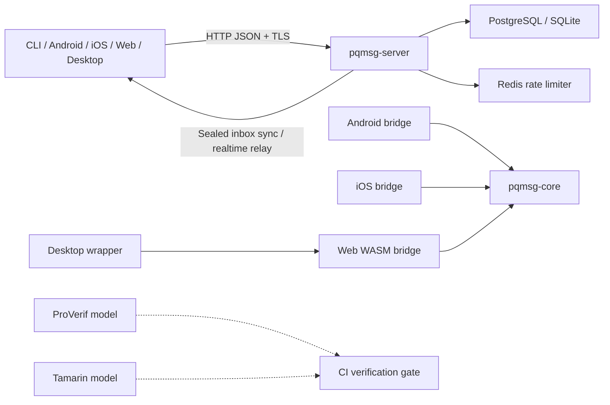

# Post-Quantum Messaging Prototype

## Abstract

This repository is a research-grade prototype for hybrid post-quantum
asynchronous messaging.

The design combines:

- X25519 classical Diffie-Hellman
- ML-KEM-family encapsulation in a PQXDH-style initiation path
- one-time prekey (DH4) consumption for replay resistance
- hybrid identity authentication with Ed25519 + ML-DSA-65
- a minimal ratcheting channel with explicit suite and wire-version continuity

The goal is not product completeness. The goal is measurable protocol
engineering with reproducible tests, strict parsers, explicit failure modes, and
clear support boundaries.

## Current Pilot Scope

As of April 5, 2026, the supported rollout is **Android pilot for messaging only**.

- Web remains a demo surface and is not part of the supported pilot.
- Outbound web direct messaging and private-group messaging stay blocked whenever the server advertises `web_client_policy = demo_only`.
- The server exposes `supported_beta_clients` so the current supported rollout is machine-readable instead of only documented prose.
- Canonical machine-readable support posture now lives in `docs/SUPPORT_MATRIX.json`.
- Calling remains out of scope for the beta on every client.
- Manual contact bootstrap on the hardened Android/web path is `@username` or opaque invite only.
- Private discovery is still not fully implemented.
- The longer-term intended private-discovery direction remains a separate enclave-backed service rather than a permanently widened blind-directory preview.
- Legacy clear-roster groups remain disabled; the opaque private-group path is advertised separately through `private_group_messaging_supported`.

## Research Positioning

The project is best interpreted as a:

**Hybrid Post-Quantum Messaging Protocol Prototype with Security Verification
Harness**

Its strongest contributions are:

- explicit protocol and wire-format documentation
- deterministic KAT and interop coverage
- strict parser behavior and fuzz targets
- hybrid handshake and session-state modeling
- authenticated, fail-closed client behavior
- cross-surface experimentation across CLI, Android, iOS, web, and desktop

## Technical Comparison

This repository is closer to a protocol and product-direction prototype than a
finished consumer messenger. The most useful technical comparison is not
"feature count", but where each system places its trust boundary.

| System | Registration and bootstrap | Default encryption boundary | Device and history model | PQ posture |
|---|---|---|---|---|
| This repository | Hardened path uses `@username` or opaque invite; identity is immutable after first bind | Supported messaging paths are designed as end-to-end, fail-closed channels over an opaque relay | Multi-surface prototype with explicit device lifecycle, repair, reset, and support gating; Android is the current beta path | Hybrid PQXDH-style initiation using X25519 plus ML-KEM-family KEMs, with explicit PQ backend policy |
| Signal | Phone number registration is required; usernames are optional for contact initiation and privacy layering | End-to-end encrypted messaging and calling by default, with safety-number verification and linked-device privacy model | Mature linked-device model with private linked communication and bounded history transfer from the phone at link time | Official PQXDH direction and deployed post-quantum migration path |
| Telegram | Cloud-account model with usernames; separate Secret Chats for stronger peer-to-peer secrecy | Cloud Chats use server-client encryption; Secret Chats add client-client end-to-end encryption | Cloud-first multi-device history for regular chats; Secret Chats stay bound to the originating devices and are not part of the cloud | Official protocol surface emphasizes MTProto and Secret Chat PFS, not a post-quantum migration story |

Technically, this project aims to be much closer to Signal than Telegram in
where confidentiality is enforced: the relay should not be trusted with message
plaintext. The main difference from Signal is maturity. Signal is a production
consumer system with a refined multi-device model and established operational
practice; this repository is still a research and beta-validation codebase with
explicit support boundaries, more visible fail-closed behavior, and a stronger
focus on post-quantum transition mechanics.

## System Architecture



## Security-Critical Design Decisions

- immutable user identity registration after first successful bind
- authenticated prekey publication and identity rotation flows
- strict TLV/wire parsing with fail-closed decode behavior
- suite, version, and ratchet metadata authenticated in AEAD associated data
- DH4 one-time prekey consumption as a replay-resistance control
- PQ backend runtime checks with fail-closed client behavior
- peer identity pinning and explicit trust decisions on key changes
- sealed-sender transport, sender certificates, and transparency-aware identity checks
- dedicated formal-verification and fuzzing gates

## Repository Layout

| Path | Role |
|---|---|
| `crates/pqmsg-core` | Cryptographic primitives, handshake, TLV, wire format, ratchet/session state |
| `crates/pqmsg-server` | Prekey publication and opaque ciphertext relay service |
| `crates/pqmsg-cli` | Local operator workflow |
| `crates/pqmsg-android` | UniFFI-facing Rust bridge for Android |
| `crates/pqmsg-ios` | UniFFI-facing Rust bridge for iOS |
| `mobile/android` | Kotlin Android demo client |
| `mobile/ios` | SwiftUI iOS demo client |
| `mobile/web` | Web demo shell with WASM PQ crypto and browser gating |
| `desktop` | Tauri desktop app wrapping the web shell |
| `deploy` | Container, Kubernetes, and Helm deployment assets |
| `observability` | Prometheus, Grafana, Loki, and Alertmanager assets |
| `docs` | Normative, operational, and security documentation |
| `verification` | Formal protocol models |
| `scripts/security` | Verification, validation, and audit helper scripts |

## Verification

High-signal local verification:

```powershell
cargo fmt --all --check
cargo clippy --workspace --all-targets -- -D warnings
cargo test --workspace
```

The broader verification story includes:

- coverage enforcement in CI
- dependency-policy checks
- ProVerif and Tamarin gates
- Android and web build validation
- interop tests
- support-matrix validation
- signed release and artifact-attestation workflows

## Getting Started

README stays high-level. Installation, local setup, emulator flow, and local app
builds live in [INSTALLATION](docs/INSTALLATION.md).

Operational deployment and release workflows live in:

- [DEPLOYMENT](docs/DEPLOYMENT.md)
- [PILOT](docs/PILOT.md)
- [OBSERVABILITY](docs/OBSERVABILITY.md)
- [OPERATIONS](docs/OPERATIONS.md)
- [RELEASE_GOVERNANCE](docs/RELEASE_GOVERNANCE.md)

## Documentation Index

| Document | Description |
|---|---|
| [INSTALLATION](docs/INSTALLATION.md) | Local installation, builds, and first-run setup |
| [SPEC](docs/SPEC.md) | Protocol specification |
| [THREAT_MODEL](docs/THREAT_MODEL.md) | Threat model and mitigations |
| [WIRE_FORMAT](docs/WIRE_FORMAT.md) | Binary wire encoding reference |
| [CRYPTO_AGILITY](docs/CRYPTO_AGILITY.md) | Algorithm suite agility design |
| [API](docs/API.md) | Server REST and WebSocket API reference |
| [SECURITY_GATES](docs/SECURITY_GATES.md) | Security quality gates policy |
| [DEPLOYMENT](docs/DEPLOYMENT.md) | Container and Kubernetes deployment guidance |
| [AWS_EC2_BACKEND](docs/AWS_EC2_BACKEND.md) | Single-EC2 backend hosting runbook for the hosted web shell |
| [PILOT](docs/PILOT.md) | Android pilot scope, launch checklist, and daily operations |
| [OBSERVABILITY](docs/OBSERVABILITY.md) | Metrics, logs, tracing, and alerting |
| [OPERATIONS](docs/OPERATIONS.md) | Operational runbooks |
| [RELEASE_GOVERNANCE](docs/RELEASE_GOVERNANCE.md) | Release gate pipeline |
| [FORMAL_AUDIT](docs/FORMAL_AUDIT.md) | Formal verification status |
| [PENETRATION_TESTING](docs/PENETRATION_TESTING.md) | Penetration test methodology |
| [ANDROID](docs/ANDROID.md) | Android architecture and integration guide |
| [IOS](docs/IOS.md) | iOS architecture and integration guide |
| [WEB](docs/WEB.md) | Web demo client and policy gating |
| [WEB_DEPLOYMENT](docs/WEB_DEPLOYMENT.md) | Hosted web shell deployment and production header contract |
| [PRIVATE_GROUPS](docs/PRIVATE_GROUPS.md) | Private-group availability and fail-closed behavior |
| [PRIVATE_CONTACT_DISCOVERY](docs/PRIVATE_CONTACT_DISCOVERY.md) | Discovery contract and client verification model |
| [DEVICE_LIFECYCLE](docs/DEVICE_LIFECYCLE.md) | Registration, linking, reset, and retirement contract |
| [VALIDATION_MATRIX](docs/VALIDATION_MATRIX.md) | Supported-flow validation contract |
| [AUDIT_READINESS](docs/AUDIT_READINESS.md) | Audit readiness package |
| [SECURITY](SECURITY.md) | Vulnerability disclosure policy |
| [CONTRIBUTING](CONTRIBUTING.md) | Contributor guide and code conventions |
