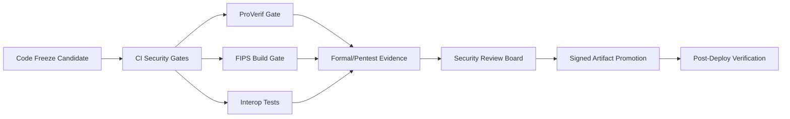

# RELEASE_GOVERNANCE

## 1. Purpose

This document defines release-control policy for production promotion of `pqmsg`.

The policy objective is to prevent uncontrolled security regressions and ensure auditable go/no-go decisions.

## 2. Release Gate Pipeline

## 3. Mandatory Go/No-Go Gates

A release candidate is promotable only when all conditions are true:

1. CI green:
   - `cargo fmt --all --check`,
   - `cargo clippy --workspace --all-targets -- -D warnings`,
   - `cargo test --workspace`.
2. dependency policy checks pass:
   - `cargo audit`,
   - `cargo deny check advisories licenses bans sources`.
3. security smoke checks pass:
   - parser fuzz smoke job,
   - penetration smoke script,
   - formal verification smoke,
   - alert escalation drill evidence (`scripts/security/alert_drill.*`) including mailbox-delivery proof.
4. hardened deployment candidates document explicit browser origins:
   - no wildcard CORS entries for `pilot` / `production`,
   - optional runtime error telemetry configuration is documented when used.
5. the hardened Helm chart renders only when those deployment-contract values are present:
   - no wildcard `env.PQMSG_CORS_ALLOWED_ORIGINS`,
   - explicit Postgres encryption + backup declarations.
6. threat-model-impacting changes include updated docs in:
   - `docs/SPEC.md`,
   - `docs/THREAT_MODEL.md`,
   - `docs/SECURITY_GATES.md`.
7. raw Kubernetes and rendered Helm deployment manifests pass hardened manifest policy:
   - `automountServiceAccountToken: false`,
   - `enableServiceLinks: false`,
   - `seccompProfile.type: RuntimeDefault`,
   - `runAsNonRoot: true`,
   - `allowPrivilegeEscalation: false`,
   - `readOnlyRootFilesystem: true`,
   - `capabilities.drop: [ALL]`.
8. raw Kubernetes and rendered Helm deployment manifests use digest-pinned server images for hardened modes; mutable `:latest` or tag-only production references are rejected.
9. release artifact includes a signed checksum manifest, a machine-readable `release-manifest.json` with the published GHCR server image digest, deployment-ready `container-image.txt` and `helm-image-overrides.yaml` references, a machine-readable `release-security-posture.json` capturing the frozen support boundary plus audit-gate result, GitHub artifact attestations for the server binary, release manifest, release security posture, and SBOM archive, and a pushed container-image provenance attestation (`release.yml`).
10. release promotion to hardened environments must consume the published release bundle (`download_release_bundle.*`, `verify_release_bundle.*`, or `promote.yml`) rather than manually transcribing image digests.
11. promotion evidence must include the live pre-promotion deployment image and rollback mapping (`promotion-record.json`, `rollback-image.txt`, `rollback-helm-overrides.yaml`) whenever cluster access is available.
12. applied promotions must record post-deploy verification evidence (`post-deploy-verification.json`) proving rollout success and the runtime `/health` + `/v1/capabilities` contract for the promoted artifact.
13. rollback execution must consume the saved promotion bundle (`download_promotion_bundle.*` or `rollback.yml`) and record rollback execution plus verification evidence (`rollback-record.json`, `post-rollback-verification.json`).
14. promotion and rollback apply paths must fail closed if the target namespace and prerequisite secrets/configmaps do not satisfy the hardened cluster contract (`cluster-contract.json`).
15. applied promotion and rollback evidence must include a resource drift report (`deployment-drift.json` / `rollback-drift.json`) covering deployment image/resourceVersion changes plus generated secret/configmap, TLS secret, and namespace-policy drift, with suspicious changes explicitly classified.
16. applied promotion and rollback evidence must include live policy verification of the fetched cluster `Deployment` and `NetworkPolicy`, not only pre-render validation (`live-policy-verification.json` / `live-rollback-policy-verification.json`).
17. applied promotion and rollback evidence must include live routing verification of the fetched `Service` and optional `Ingress`, and fail if the live routing surface diverges from the rendered chart contract (`live-routing-verification.json` / `live-rollback-routing-verification.json`).
18. failed promotion and rollback runs must still emit an incident-ready handoff record summarizing failed checks, suspicious drift, rollout state, and missing evidence files (`promotion-failure-handoff.json` / `rollback-failure-handoff.json`).
19. the incident handoff record is itself a blocking gate for applied promotions and rollbacks; any required incident or suspicious drift keeps the workflow red even if Helm apply completed.
20. when `PQMSG_ALERTMANAGER_API_URL` is configured for the target GitHub Environment, applied promotion and rollback failures must also emit and submit Alertmanager-compatible incident payloads derived from the handoff record.
21. governance-failure escalation must leave delivery evidence in the bundle (`promotion-incident-submission.json` / `rollback-incident-submission.json`) so reviewers can distinguish skipped escalation from Alertmanager delivery failure.
22. when `PQMSG_INCIDENT_ISSUE_REPO` is configured for the target GitHub Environment, the same incident must be published into GitHub Issues, labeled with the shared `pqmsg-*` incident taxonomy, and leave a publication record in the bundle (`promotion-incident-issue-publication.json` / `rollback-incident-issue-publication.json`).
23. successful applied remediation runs must attempt to resolve older open incident issues in the same deployment scope, transition the issue status label from open to resolved, and leave a resolution record in the bundle (`promotion-incident-issue-resolution.json` / `rollback-incident-issue-resolution.json`).
24. every uploaded promotion/rollback bundle must include a SHA-256 inventory of its emitted evidence files (`promotion-bundle-manifest.json` / `rollback-bundle-manifest.json`).
25. when durable incident issues are enabled, the workflows must also comment the final bundle-manifest filename and SHA-256 digest back onto the corresponding issue thread so the GitHub record references the archived evidence set directly.
26. workflow-driven GitHub issue comments for incident publication and final evidence must be idempotent on rerun; duplicate retries must resolve to an existing marker-matched comment instead of posting a second copy.
27. the promotion and rollback workflows must GitHub-attest the emitted bundle-manifest artifacts themselves, and CI must validate that those attestation and permission requirements remain present in workflow policy.
28. any workflow that consumes a previously uploaded promotion/rollback bundle must verify the bundle-manifest inventory before using the bundle, and should verify the bundle-manifest attestation when `gh` is available.
29. tagged releases must fail closed if `docs/AUDIT_FINDINGS.json` contains unresolved `critical` or `high` findings, or if a `risk_accepted` exception for those severities has expired (`scripts/security/validate_release_audit_gate.py`).
30. applied promotion and rollback verification must prove the live `/v1/capabilities` support boundary still matches the published `release-security-posture.json` frozen at release time, not just that the endpoint is reachable.
31. applied promotions must run an end-to-end encrypted backup upload/recovery smoke check against the live HTTPS API endpoint and archive the result (`post-deploy-backup-smoke.txt`), failing closed on missing API URL configuration or smoke-check failure.

## 4. Security Exception Policy

Any exception to a mandatory gate requires a signed risk record with:

1. finding reference and severity,
2. explicit compensating controls,
3. expiry date for exception,
4. accountable owner and closure milestone.

Exceptions are invalid after expiry and block subsequent promotions until renewed or closed.
For tracked audit findings, exceptions live in `docs/AUDIT_FINDINGS.json` with `status: risk_accepted`, `owner`, and `risk_acceptance_expires_on_utc`.

## 5. Change Classification

Classify each release candidate:

1. `Class A`: crypto/protocol/auth/routing changes,
2. `Class B`: transport/storage/observability control changes,
3. `Class C`: UI/docs/non-security-functional changes.

`Class A` changes require dual reviewer approval including a security reviewer.

## 6. Rollback Governance

Every production promotion must define:

1. rollback target artifact digest,
2. rollback execution owner,
3. rollback trigger thresholds,
4. post-rollback validation checklist.

Minimum rollback triggers:

1. sustained 5xx alert breach post-deploy,
2. unexpected auth reject spike attributable to candidate build,
3. detected integrity policy violation.

## 7. Post-Release Security Review

Within `48h` of promotion:

1. review security-event counters for abnormal deltas,
2. verify audit-log continuity and ingestion,
3. confirm release-bundle verification succeeded from the published assets (`scripts/release/verify_release_bundle.*`),
4. confirm no unresolved critical/high findings were introduced,
5. store release evidence package (CI logs, artifact signatures/attestations, incident notes).
