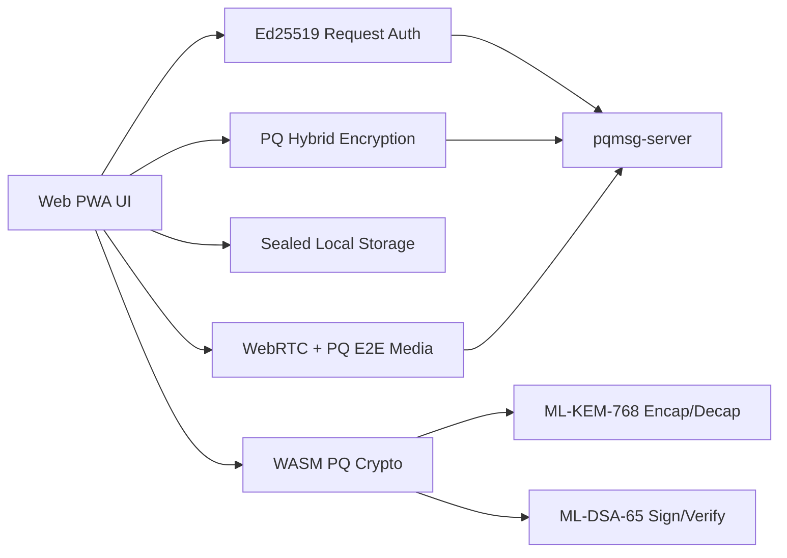

# WEB

## 1. Objective

This document specifies the web client deployment shape and the current pilot-holdback path for the PQ messaging prototype.

The Android pilot launch contract and operations runbook live in [PILOT](PILOT.md).

The web client requires the WASM PQ runtime for messaging:

- **WASM PQ mode**: real ML-KEM-768 key encapsulation and ML-DSA-65 signatures via compiled Rust WASM bindings.

The current release train does not treat the web client as a supported pilot messaging client by default, and web calling is out of scope.

The hosted deployment guidance for the production web shell lives in [WEB_DEPLOYMENT](WEB_DEPLOYMENT.md).
The exact VPS bundle/rollout tooling now lives in:

- `scripts/release/package_web_release.py`
- `deploy/web/vps/deploy_pqmsg_web_release.sh`
- `scripts/security/validate_hosted_web_headers.py`

Manual contact bootstrap on the hardened web path is `@username` or opaque invite only. Raw-hash contact discovery remains disabled.

## 2. Security Position

WASM bindings and call prototypes still exist as research paths in the repo, but they are not the supported pilot path:



For the current pilot rollout:

- Android is the supported pilot messaging client.
- Web remains demo-only.
- Web remains demo-only in the live rollout contract even though the static web shell can now be hosted with a hardened production header and caching profile.
- Outbound web direct messaging and private-group messaging are blocked whenever the server reports `web_client_policy = demo_only`.
- Even when the server permits hardened web messaging, private groups additionally require `private_group_messaging_supported = true`.
- The live capability contract also exposes `supported_beta_clients`, so the server can advertise when `web` is actually in the supported rollout matrix instead of demo-only.
- `docs/SUPPORT_MATRIX.json` is the canonical machine-readable support matrix for the current pilot posture.
- Web messaging fails closed when the browser lacks HTTPS-or-loopback origin protection, an actual secure browser context, cross-origin isolation on hosted origins, IndexedDB, SubtleCrypto, WebAssembly, or text encoding support.
- The SPA shell now uses a shared response-header contract: Vite dev/preview keeps loopback allowances for local servers, while hosted production uses an HTTPS/WSS-only header profile described in [WEB_DEPLOYMENT](WEB_DEPLOYMENT.md).
- The service worker only caches same-origin app-shell assets; cross-origin API traffic and `/v1/*` messaging traffic are never cached by the web shell.
- Calling is unavailable from the web UI.
- When `contact_discovery_mode = private_service`, the web client verifies the signed manifest, app-server-pinned discovery contract fields, optional nonce-bound attestation evidence, and continuity-pins that service contract on this browser before discovery can proceed.
- The web client also rejects discovery `evaluate`, `handles`, and `match` responses if `manifest_contract_sha256` or `ticket_nonce` drift from the already-verified manifest contract and issued ticket.
- For peer transparency, the web client still fails closed on proof/pin mismatch. The only bounded recovery exception is a stale `previous_tree_size` checkpoint: if the server rejects that checkpoint as out of range, the client refetches the proof once without `previous_tree_size` and still requires the refreshed proof to match the pinned identity.

## 3. Prerequisites

- Node.js 20+,
- running `pqmsg-server` endpoint,
- optional: `wasm-pack` for building Rust WASM bindings.

## 4. Development Commands

```bash
cd mobile/web
npm install
npm run dev
```

Default Vite URL:

- `http://127.0.0.1:5173`

## 5. Production Build

```bash
cd mobile/web
npm install
npm run build
npm run preview
```

The hardened production build now emits no JavaScript sourcemaps by default.

Hosted production deploys should use the static server configuration in [WEB_DEPLOYMENT](WEB_DEPLOYMENT.md), not the Vite preview server.

## 6. Runtime Workflow

1. Setup card:
   - set server URL, user, device, peer, suite, passphrase,
   - generate keys,
   - register user,
   - publish prekeys.
2. Claim a shareable `@username` in Settings if you want a stable manual contact handle.
3. Fetch peer bundle before first send.
4. Review the server capability policy before treating web direct or private-group messaging as available.
5. Poll inbox to decrypt.
6. Review pinned identities and trust state in Security Snapshot.

## 7. PWA Shell Components

- `manifest.webmanifest`
- `sw.js`
- installable app metadata and local cache bootstrap.

## 8. Interoperability Note

Web messaging requires the WASM PQ runtime. Legacy fallback envelopes are rejected on the hardened path.

Do not treat the web client as part of the supported pilot when the server remains in `demo_only` web mode. The Android messaging path remains the release baseline.

## 9. WASM PQ Crypto

The WASM build exports:

- `wasm_kem_keypair()` — generate ML-KEM-768 keypair,
- `wasm_kem_encapsulate(recipient_pk)` — encapsulate shared secret,
- `wasm_kem_decapsulate(secret_key, ciphertext)` — decapsulate shared secret,
- `wasm_ml_dsa_keypair()` — generate ML-DSA-65 signing keypair,
- `wasm_ml_dsa_sign(message, secret_key)` — sign message,
- `wasm_ml_dsa_verify(message, signature, public_key)` — verify signature.

Wrapper functions in `crypto-wasm.ts` provide TypeScript-friendly interfaces.

## 10. Calling Status

Calling code paths are still present for research work, but web calling is not part of the supported pilot:

- chat surfaces no longer expose web calling as a supported action,
- incoming and outgoing call routes are held back in the UI,
- tester guidance should keep web calling out of scope until a supported media path is validated.

For reference, the repository still contains a WebRTC calling prototype with post-quantum media-encryption work:

1. **Call initiation**: `startCall(peerId, video)` creates an `RTCPeerConnection` and sends an SDP offer via the signaling REST API.
2. **PQ key exchange**: Before SDP exchange, the client performs a PQXDH handshake (via WASM when available) to derive a `media_key`.
3. **Media encryption**: WebRTC Insertable Streams (Encoded Transform) encrypt/decrypt RTP payloads with `media_key` + ChaCha20-Poly1305.
4. **Call UI**: Incoming call overlay, in-call controls (mute, video toggle, hangup), call timer, and PQ-encrypted badge.

Call signaling uses format-string authenticated REST endpoints:

- `POST /v1/call/offer` — send SDP offer,
- `POST /v1/call/:call_id/answer` — send SDP answer,
- `POST /v1/call/:call_id/ice` — exchange ICE candidates,
- `POST /v1/call/:call_id/hangup` — terminate call,
- `GET /v1/call/:call_id/signals` — poll call signals.

## 11. Desktop App (Tauri)

The web SPA is also packaged as a native desktop application via Tauri 2:

```bash
cd desktop
npm install
npm run dev     # development with hot-reload
npm run build   # production build (.msi / .dmg / .AppImage)
```

Tauri wraps the same Vite SPA in a native window with:

- system tray support,
- native notifications,
- file drag-and-drop,
- CSP-enforced content security.
## Support Matrix

## Support Matrix

| Algorithm / Feature | Status | Notes |
| :--- | :--- | :--- |
| **ML-KEM (Kyber)** | ⚠️ Demo Only | WASM implementation; Web remains demo-only. |
| **ML-DSA (Dilithium)** | ⚠️ Demo Only | WASM implementation; Web remains demo-only. |
| **Hybrid Key Exchange** | ❌ Unsupported | Restricted to native clients. |
| **FIPS 140-3 Mode** | ❌ Unsupported | Browser environment limitation. |

> **Warning:** This platform is not for production use. Web remains demo-only.
